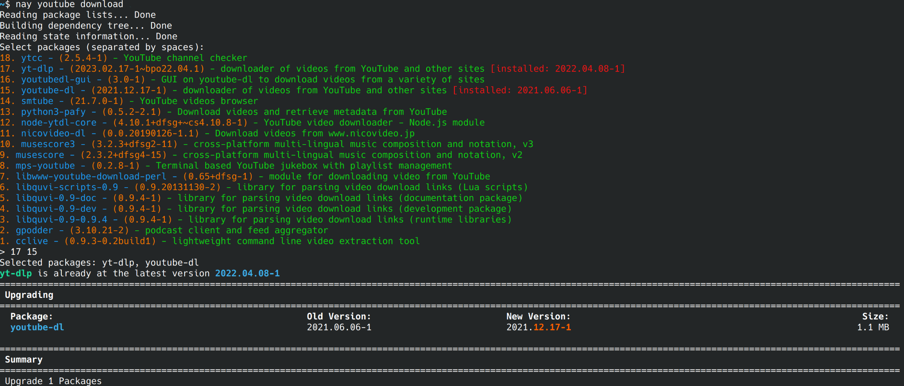

# nay
Nay is a WIP wrapper around apt/nala to search in a similar way to yay/paru on Arch, where packages are listed and indexed and the user enters the index of the items to install.



# Install
```
git clone https://github.com/erydactyl/nay
cd nay
sudo cp nay.py /usr/bin/nay
sudo chmod +x /usr/bin/nay
```

# Usage
```
nay (search term)
```
